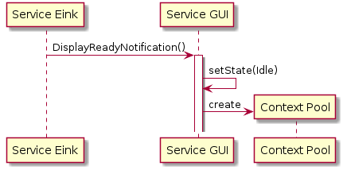
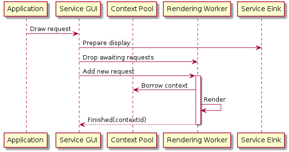
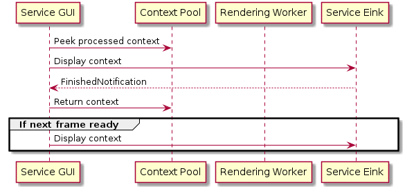
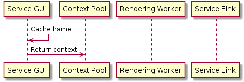

# GUI services

The GUI service is responsible for rendering frames and sharing them with the EInk service. This includes:
- Managing the pool of contexts
- Dropping frames that are not needed anymore
- Rendering frames
- Controlling the flow of sharing frames with the EInk service

## Initialisation

GUI service is initialized on the EInk service demand. It uses information received from the EInk service in order to initialise its resources, e.g. ContextPool.

## Handling draw requests

Draw request is an Application's request used to re-render the screen.

## Sharing the frame with the EInk service

### Idle state

If the GUI service is not busy waiting for the previous frame is displayed by the EInk service, it immediately sends the rendered frame to the EInk service.

### Busy state

The GUI service may render a few next frames while the EInk service is updating the display. If so, the GUI service caches the last rendered frame and immediately sends it to the EInk service once it finishes its job.

